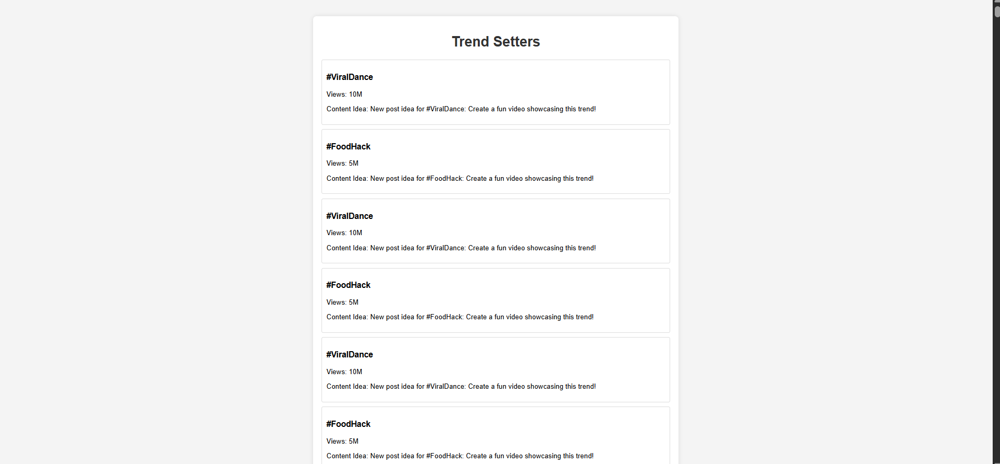

# Trend Setters

Welcome to **Trend Setters**, a web application designed to scrape TikTok trends, generate content ideas using AI, and display the results in an interactive dashboard. This project combines a Python-based backend with a simple HTML/CSS/JavaScript frontend to provide a prototype for trend analysis and content creation.

## Table of Contents
- [Overview](#overview)
- [Features](#features)
- [Project Structure](#project-structure)
- [Setup Instructions](#setup-instructions)
- [Usage](#usage)
- [Screenshots](#screenshots)
- [Contributing](#contributing)

## Overview
Trend Setters leverages mock data to simulate TikTok trend scraping and AI-generated content suggestions. The backend uses Flask to serve an API, while the frontend provides a user-friendly interface to view and download trends. This project serves as a foundation for building a fully functional trend analysis tool with real API integrations.

## Features
- Scrapes mock TikTok trend data (placeholder for real scraping).
- Generates mock AI-based content ideas (placeholder for OpenAI integration).
- Stores trends in a SQLite database.
- Displays trends in a responsive dashboard.
- Allows downloading trends data as a CSV file.
- Schedules trend updates every hour (simulated).

## Project Structure
```
trend-setters/
├── backend/
│   ├── scraper.py          # Simulates TikTok trend scraping
│   ├── ai_processor.py     # Simulates AI content generation
│   ├── database.py         # Manages SQLite database
│   ├── scheduler.py        # Handles task scheduling
│   └── app.py              # Flask API server
├── frontend/
│   └── dashboard.html      # Main dashboard with embedded CSS and JS
├── output/
│   ├── screenshots/        # Stores application screenshots
│   └── exports/            # Stores generated content exports
├── config.json             # Configuration file for API keys
├── requirements.txt        # Python dependencies
├── README.md               # Project documentation
└── LICENSE                 # MIT License
```

## Setup Instructions
### Prerequisites
- Python 3.8 or higher
- Node.js (for serving the frontend)
- Git (optional, for cloning the repository)

### Installation
1. **Clone the Repository**:
   ```bash
   git clone (https://github.com/MohamedEssamML/trend-setters.git/)
   cd trend-setters
   ```

2. **Set Up a Virtual Environment**:
   ```bash
   python -m venv venv
   source venv/bin/activate  # Linux/macOS
   venv\Scripts\activate     # Windows
   ```

3. **Install Dependencies**:
   ```bash
   pip install -r requirements.txt
   npm install -g serve
   ```

4. **Configure API Keys (Optional for Real Use)**:
   - Edit `config.json` with your TikTok and OpenAI API keys (currently unused with mock data):
     ```json
     {
         "openai_api_key": "your-openai-api-key-here",
         "tiktok_api_key": "your-tiktok-api-key-here"
     }
     ```

5. **Initialize the Database**:
   - The database (`trends.db`) will be created automatically when you run the backend.

## Usage
1. **Start the Backend**:
   - In one terminal, activate the virtual environment and run:
     ```bash
     python backend/app.py
     ```
   - The Flask server will start on `http://localhost:5000`, and the scheduler will run tasks every hour.

2. **Serve the Frontend**:
   - In another terminal, navigate to the project root and run:
     ```bash
     npx serve frontend
     ```
   - Open your browser and go to `http://localhost:3000/dashboard.html`.

3. **View the Dashboard**:
   - You should see the "Trend Setters" title and a list of mock trends (e.g., #ViralDance with 10M views and a content idea).
   - Click the "Download Trends" button to download the trends data as a `trends.csv` file.

## Screenshots

*Description: The dashboard displays the "Trend Setters" title with a clean, centered layout, a download button, and a list of trends (e.g., #ViralDance) below once the backend is running. Last updated: 11:13 PM EEST, Tuesday, June 10, 2025.*

### How to Add a Screenshot
- Take a screenshot of the dashboard (e.g., using your browser’s developer tools or a tool like Snipping Tool).
- Save it as `dashboard.png` in the `output/screenshots/` directory.
- Update the image path in the `` line with the correct filename if different.

## Contributing
Contributions are welcome! To contribute:
1. Fork the repository.
2. Create a new branch (`git checkout -b feature-branch`).
3. Make your changes and commit them (`git commit -m "Add feature"`).
4. Push to the branch (`git push origin feature-branch`).
5. Open a pull request.

```

### Instructions
1. **Save the File**: Copy the content within the `<xaiArtifact>` tag above, paste it into a text editor, and save it as `README.md` in the `trend-setters` directory.
2. **Verify**: Open the file in a Markdown viewer (e.g., VS Code with a Markdown extension, or GitHub) to ensure it renders correctly.
3. **Update Project Files**: Ensure `backend/app.py` and `frontend/dashboard.html` include the download functionality from my earlier responses to match the `Usage` section.

This README is now ready for GitHub, with all text properly formatted as Markdown. If you need further adjustments or help with adding the screenshot, let me know!
